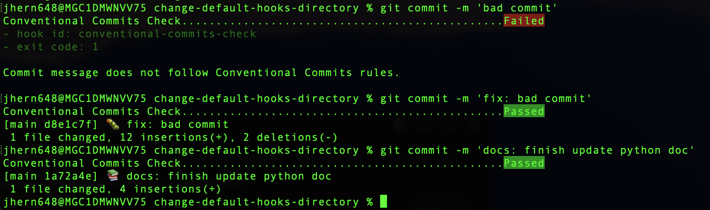

# change-default-hooks-directory

A small example about how to change and run git hooks in a different directory.

By default git checks the hooks on the directory `.git/hooks` but you can change them to be used anywhere.

# Repository organization

The hooks are on different directories depending the language you want to use, currently:

- Python: `githooks-python`
- Bash: `githooks-bash`

# How to make git able to use them

Use the next command:

`git config --local core.hooksPath <PATH OF THE HOOKS>`

Example:

- Python: `git config --local core.hooksPath ./githooks-python`
- Bash: `git config --local core.hooksPath ./githooks-bash`

# Security and Permission Control

Set the hooks with those rights:

`chmod -R 755 <PATH TO HOOKS>`

## How to use with Python

You need to install `pre-commit` and `conventional-commits-check` by using pip.

`pip install pre-commit`

After, create on the root directory `.pre-commit-config.yaml` and a `commits_check_config.yaml` that contains the pre-commit configuration (both need to be the same):

```yml
repos:
  # Repository where we are using the conventional commits check
  - repo: https://github.com/AliYmn/conventional-commits-check
    rev: V1.0.4  # Use the latest release version
    # Hooks and stages used
    hooks:
      - id: conventional-commits-check
        stages: [commit-msg]
```

Then, execute this to update the hooks:

`pre-commit install --hook-type commit-msg -f`

If fails because you have set the previous hooks, unset them by 

Finish by updating the hooks by:

`git config --global unset core.hooksPath`

And set them again as previously:

`git config --local core.hooksPath ./githooks-python`

To finish, update the pre-commit and commit hooks again.

`pre-commit autoupdate`

**Result on bad and good commit message by using conventional commits**



### Possible problems

| Problem | Cause | Solution |
| ------- | ----- | -------- |
| Unable to find `pip` | `pip` is not installed or maybe you have `pip3` installed | You can make an alias for `pip3` to `pip` (`alias pip=pip3`). Also check that `python` is installed on your system. |
| After installing `pre-commit` the command doesn't work | The `pip` installed commands is not on your path.<br/ >Add it to the systems or user path | Add the location where the `pip` is installing packages to your path.<br/> Usually on MacOS are in `/Library/Frameworks/Python.framework/Versions/3.11/bin` if you installed Python via XCode. If not, check where the executables are on your system.<br />Add that location to your `.bashrc` or `.zshrc` file or your system path on your Windows. |


